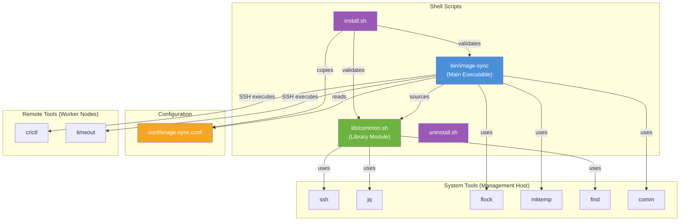
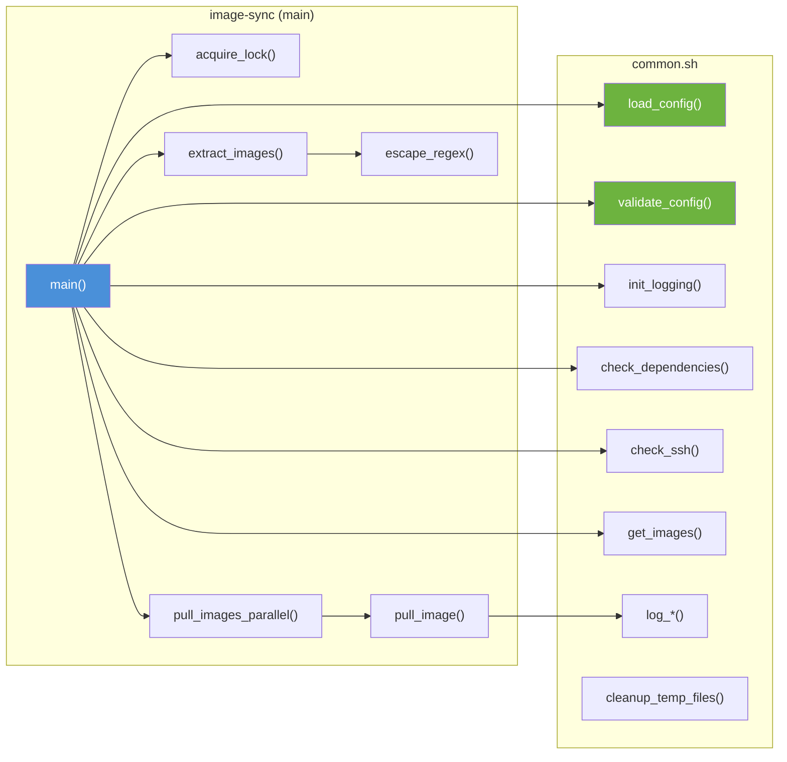

# Dependency Diagram

This document illustrates the dependency relationships between components and external tools.

## Module Dependencies

## Dependency Matrix

### Runtime Dependencies

| Component | Depends On | Type |
|-----------|-----------|------|
| `image-sync` | `common.sh` | Source (library) |
| `image-sync` | `image-sync.conf` | Configuration |
| `image-sync` | `ssh` | System tool |
| `image-sync` | `flock` | Concurrency control |
| `image-sync` | `comm` | Set comparison |
| `image-sync` | `mktemp` | Temp file creation |
| `common.sh` | `ssh` | Remote execution |
| `common.sh` | `jq` | JSON parsing |
| `common.sh` | `find` | Log cleanup |

### Remote Dependencies (on Worker Nodes)

| Tool | Purpose |
|------|---------|
| `crictl` | List and pull container images |
| `timeout` | Enforce pull time limits |

## Function Dependencies

## Configuration Parameters

| Parameter | Used By | Default |
|-----------|---------|---------|
| `NODE1`, `NODE2` | `check_ssh()`, `get_images()`, `pull_image()` | Required |
| `PREFIX1`, `PREFIX2` | `extract_images()` | Required / Optional |
| `LOG_DIR` | `init_logging()` | Required |
| `MAX_PARALLEL` | `pull_images_parallel()` | 4 |
| `TIME_OUT` | `pull_image()` | 1800s |
| `SSH_CONNECT_TIMEOUT` | `check_ssh()`, `get_images()` | 10s |
| `LOG_LEVEL` | `log_message()` | INFO |
| `MAX_LOG_SIZE` | `safe_append_log()` | 10MB |
| `LOG_RETENTION_DAYS` | `cleanup_old_logs()` | 30 |

