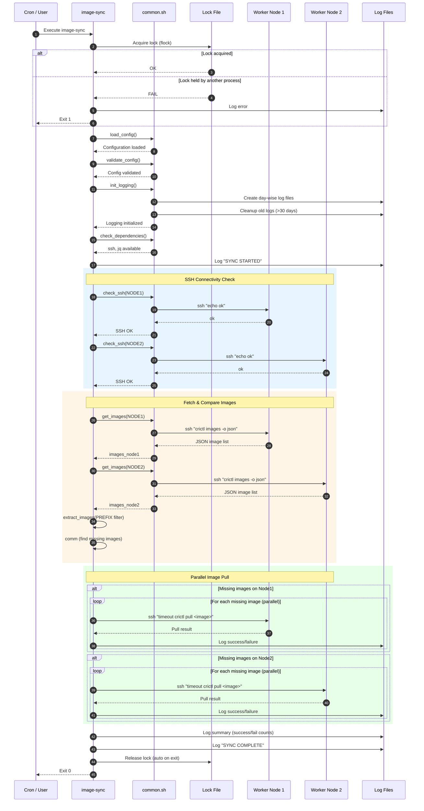
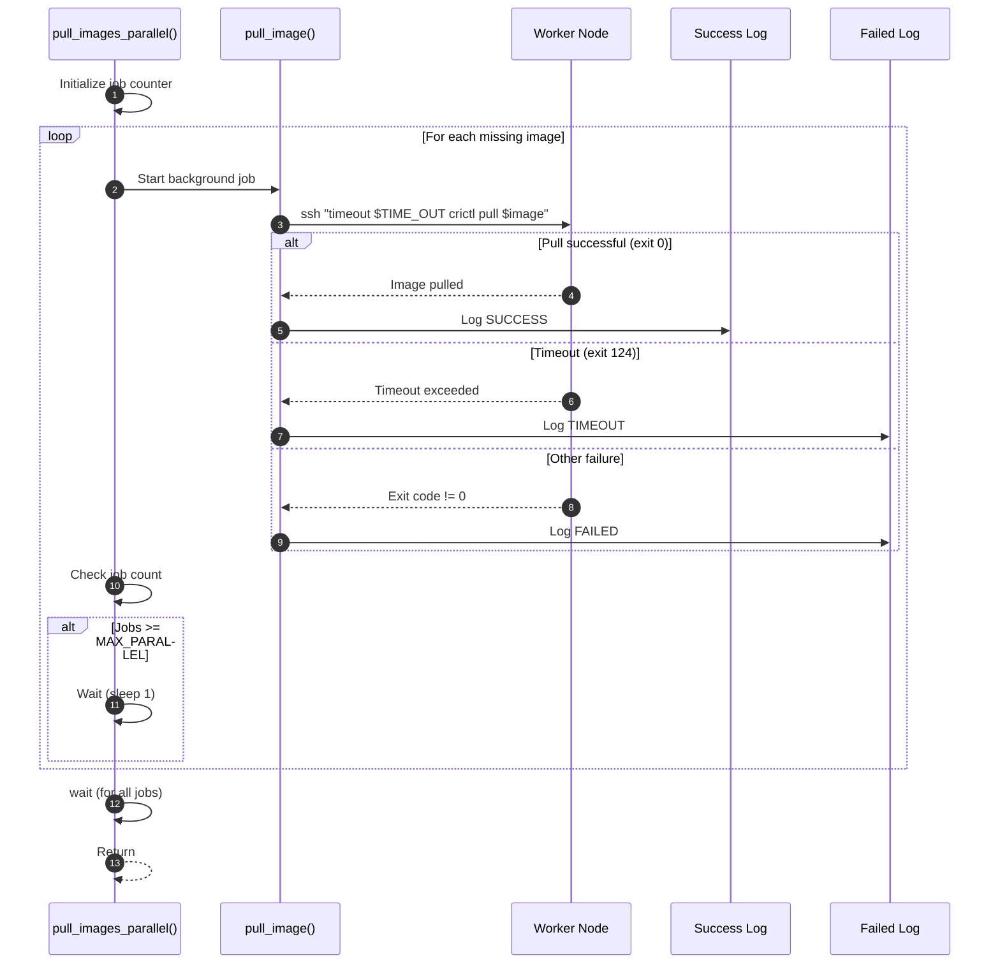
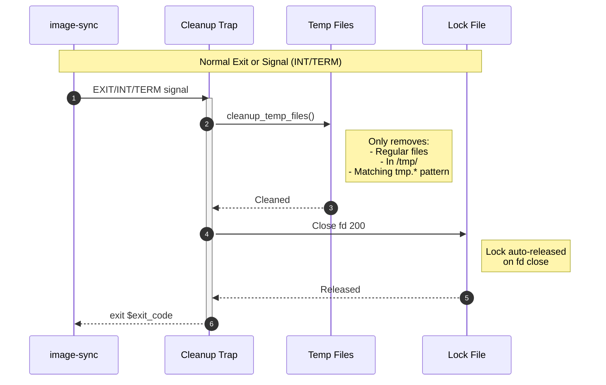
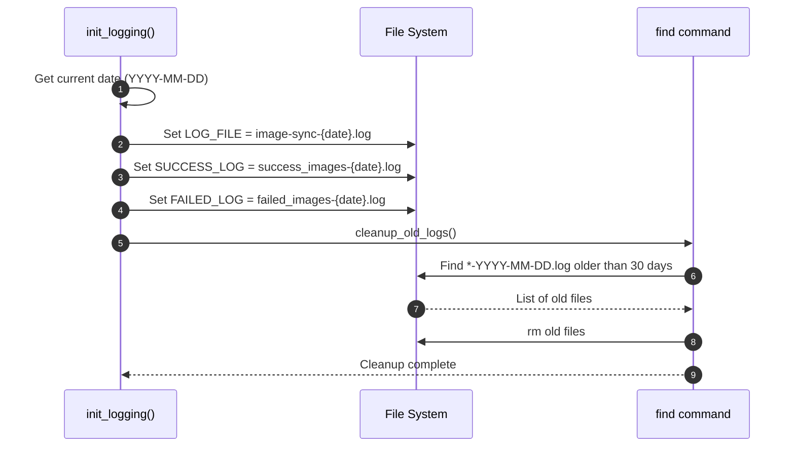

# Sequence Diagram

This document illustrates the runtime flow of the Image Sync tool.

## Main Sync Flow

```mermaid
sequenceDiagram
    autonumber
    participant Cron as Cron / User
    participant IS as image-sync
    participant LIB as common.sh
    participant Lock as Lock File
    participant Node1 as Worker Node 1
    participant Node2 as Worker Node 2
    participant Logs as Log Files

    Cron->>IS: Execute image-sync
    IS->>Lock: Acquire lock (flock)
    
    alt Lock acquired
        Lock-->>IS: OK
    else Lock held by another process
        Lock-->>IS: FAIL
        IS->>Logs: Log error
        IS-->>Cron: Exit 1
    end

    IS->>LIB: load_config()
    LIB-->>IS: Configuration loaded
    
    IS->>LIB: validate_config()
    LIB-->>IS: Config validated
    
    IS->>LIB: init_logging()
    LIB->>Logs: Create day-wise log files
    LIB->>Logs: Cleanup old logs (>30 days)
    LIB-->>IS: Logging initialized
    
    IS->>LIB: check_dependencies()
    LIB-->>IS: ssh, jq available
    
    IS->>Logs: Log "SYNC STARTED"

    rect rgb(230, 245, 255)
        Note over IS,Node2: SSH Connectivity Check
        IS->>LIB: check_ssh(NODE1)
        LIB->>Node1: ssh "echo ok"
        Node1-->>LIB: ok
        LIB-->>IS: SSH OK
        
        IS->>LIB: check_ssh(NODE2)
        LIB->>Node2: ssh "echo ok"
        Node2-->>LIB: ok
        LIB-->>IS: SSH OK
    end

    rect rgb(255, 245, 230)
        Note over IS,Node2: Fetch & Compare Images
        IS->>LIB: get_images(NODE1)
        LIB->>Node1: ssh "crictl images -o json"
        Node1-->>LIB: JSON image list
        LIB-->>IS: images_node1
        
        IS->>LIB: get_images(NODE2)
        LIB->>Node2: ssh "crictl images -o json"
        Node2-->>LIB: JSON image list
        LIB-->>IS: images_node2
        
        IS->>IS: extract_images(PREFIX filter)
        IS->>IS: comm (find missing images)
    end

    rect rgb(230, 255, 230)
        Note over IS,Node2: Parallel Image Pull
        
        alt Missing images on Node1
            loop For each missing image (parallel)
                IS->>Node1: ssh "timeout crictl pull <image>"
                Node1-->>IS: Pull result
                IS->>Logs: Log success/failure
            end
        end
        
        alt Missing images on Node2
            loop For each missing image (parallel)
                IS->>Node2: ssh "timeout crictl pull <image>"
                Node2-->>IS: Pull result
                IS->>Logs: Log success/failure
            end
        end
    end

    IS->>Logs: Log summary (success/fail counts)
    IS->>Logs: Log "SYNC COMPLETE"
    IS->>Lock: Release lock (auto on exit)
    IS-->>Cron: Exit 0
```

## Image Pull Detail

```mermaid
sequenceDiagram
    autonumber
    participant IS as pull_images_parallel()
    participant PI as pull_image()
    participant Node as Worker Node
    participant SL as Success Log
    participant FL as Failed Log

    IS->>IS: Initialize job counter
    
    loop For each missing image
        IS->>PI: Start background job
        PI->>Node: ssh "timeout $TIME_OUT crictl pull $image"
        
        alt Pull successful (exit 0)
            Node-->>PI: Image pulled
            PI->>SL: Log SUCCESS
        else Timeout (exit 124)
            Node-->>PI: Timeout exceeded
            PI->>FL: Log TIMEOUT
        else Other failure
            Node-->>PI: Exit code != 0
            PI->>FL: Log FAILED
        end
        
        IS->>IS: Check job count
        alt Jobs >= MAX_PARALLEL
            IS->>IS: Wait (sleep 1)
        end
    end
    
    IS->>IS: wait (for all jobs)
    IS-->>IS: Return
```

## Error Handling Flow

```mermaid
sequenceDiagram
    autonumber
    participant IS as image-sync
    participant Trap as Cleanup Trap
    participant TMP as Temp Files
    participant Lock as Lock File

    Note over IS,Lock: Normal Exit or Signal (INT/TERM)
    
    IS->>Trap: EXIT/INT/TERM signal
    activate Trap
    
    Trap->>TMP: cleanup_temp_files()
    Note right of TMP: Only removes:<br/>- Regular files<br/>- In /tmp/<br/>- Matching tmp.* pattern
    TMP-->>Trap: Cleaned
    
    Trap->>Lock: Close fd 200
    Note right of Lock: Lock auto-released<br/>on fd close
    Lock-->>Trap: Released
    
    Trap-->>IS: exit $exit_code
    deactivate Trap
```

## Log Rotation Flow

```mermaid
sequenceDiagram
    autonumber
    participant IS as init_logging()
    participant FS as File System
    participant Find as find command

    IS->>IS: Get current date (YYYY-MM-DD)
    IS->>FS: Set LOG_FILE = image-sync-{date}.log
    IS->>FS: Set SUCCESS_LOG = success_images-{date}.log
    IS->>FS: Set FAILED_LOG = failed_images-{date}.log
    
    IS->>Find: cleanup_old_logs()
    Find->>FS: Find *-YYYY-MM-DD.log older than 30 days
    FS-->>Find: List of old files
    Find->>FS: rm old files
    Find-->>IS: Cleanup complete
```

