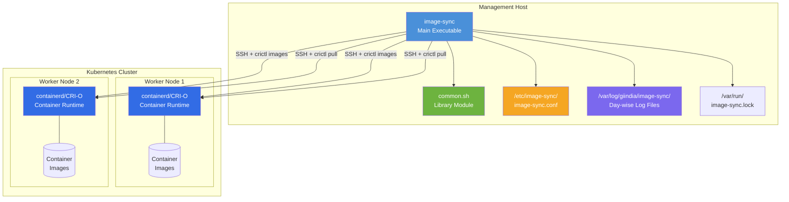

# System Architecture

This document describes the high-level architecture of the Image Sync tool.

## Overview

Image Sync is a Bash-based automation tool that ensures container images are synchronized across Kubernetes worker nodes. It runs from a management host and uses SSH to communicate with target nodes.

## Architecture Diagram

## Components

| Component | Location | Description |
|-----------|----------|-------------|
| **image-sync** | `/opt/image-sync/bin/` | Main executable script |
| **common.sh** | `/opt/image-sync/lib/` | Shared library (logging, config, SSH helpers) |
| **image-sync.conf** | `/etc/image-sync/` | Configuration file |
| **Log Directory** | `/var/log/giindia/image-sync/` | Day-wise rotating logs |
| **Lock File** | `/var/run/image-sync.lock` | Prevents concurrent execution |
| **Symlink** | `/usr/local/bin/image-sync` | System-wide command access |

## External Dependencies

| Dependency | Purpose |
|------------|---------|
| **SSH** | Secure communication with worker nodes |
| **jq** | JSON parsing for `crictl images` output |
| **crictl** | Container runtime CLI (on worker nodes) |
| **flock** | File locking for concurrency control |

## Execution Model

- **Trigger**: Cron job (recommended: every 30 minutes)
- **Concurrency**: Single instance enforced via flock
- **Parallelism**: Up to `MAX_PARALLEL` concurrent image pulls per node
- **Timeout**: Individual pull operations timeout after `TIME_OUT` seconds

